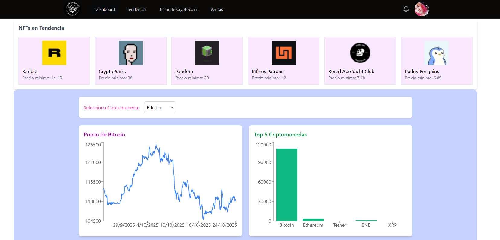
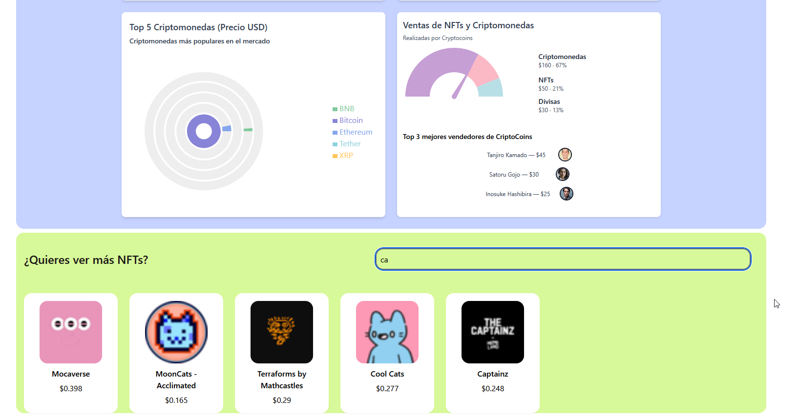

# React + Vite

This template provides a minimal setup to get React working in Vite with HMR and some ESLint rules.

Currently, two official plugins are available:

- [@vitejs/plugin-react](https://github.com/vitejs/vite-plugin-react/blob/main/packages/plugin-react) uses [Babel](https://babeljs.io/) (or [oxc](https://oxc.rs) when used in [rolldown-vite](https://vite.dev/guide/rolldown)) for Fast Refresh
- [@vitejs/plugin-react-swc](https://github.com/vitejs/vite-plugin-react/blob/main/packages/plugin-react-swc) uses [SWC](https://swc.rs/) for Fast Refresh

## React Compiler

The React Compiler is not enabled on this template because of its impact on dev & build performances. To add it, see [this documentation](https://react.dev/learn/react-compiler/installation).

## Expanding the ESLint configuration

If you are developing a production application, we recommend using TypeScript with type-aware lint rules enabled. Check out the [TS template](https://github.com/vitejs/vite/tree/main/packages/create-vite/template-react-ts) for information on how to integrate TypeScript and [`typescript-eslint`](https://typescript-eslint.io) in your project.

# Crypto Dashboard – Prueba Técnica Front-End

**Autor:** Leonor Alejandra 
**Fecha:** Octubre 2025  
**Empresa ficticia:**  Cryptocoins
**Prueba requerida por:** Dinametra

---

##  Descripción General
Este proyecto es un **dashboard interactivo** que visualiza datos de criptomonedas en tiempo real usando la API pública de **CoinGecko**, junto con una galería de NFTs en tendencia gracias a la **API de Moralis**.

Incluye:
- Gráficos dinámicos con Recharts
- Filtros interactivos para selección de criptomonedas
- Diseño responsivo con Tailwind 
- Galería de NFTs en tendencia (Con la API Moralis) 
- Manejo de errores y estados de carga 

---

## Tecnologías Usadas
- **React + Vite**
- **Tailwind**
- **Recharts**
- **CoinGecko API**
- **Moralis Web3 Data API**
- **JavaScript (ES6+)**
- **Jest**

---

## Instalación y Uso

1. Clona este repositorio:
   ```bash
   git clone https://github.com/HannahGloria/dashboardTest
   cd dashboard

2. Instala dependencias:
npm install 

3. Crea un archivo .env en la raiz del proyecto:
VITE_MORALIS_API_KEY=TU_API_KEY
Puedes conseguir tu propia API en https://admin.moralis.com/

4. Ejecuta el proyecto:
npm run dev

## Capturas de pantalla



## Pruebas

Se incluyeron pruebas unitarias básicas con Jest para validar componentes y funciones principales.

## Manejo de Errores

Se muestran mensajes amigables si falla la API.
Incluye estados de carga (loading) mientras se obtienen los datos.

